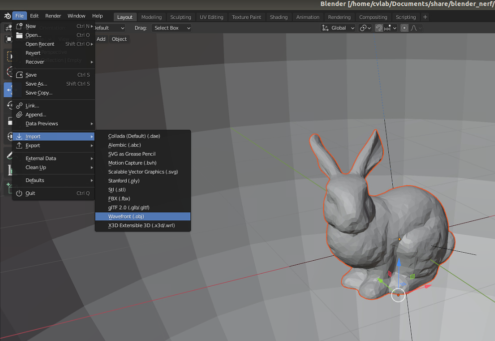
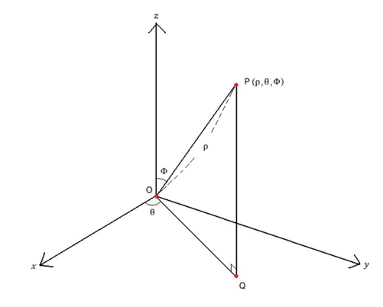
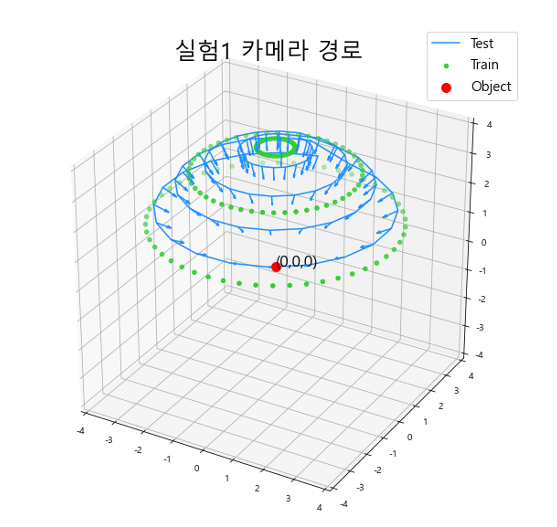

- [1장 Datasets 생성](#1--datasets---)
- [2장 Camera_trajectory 생성](#2--camera-trajectory---)
- [3장 nerf 환경 설정](#3--nerf------)
- [4장 결과 비교 및 정량적 평가](#4----------------)
---
## 1장 Datasets 생성
- Blender에 OBJ 파일 배치
- Scripting을 통한 Datasets 생성
### 1.1 Blender에 OBJ 파일 배치

- File - import - WaveFront(.obj)를 통해 object를 불러옵니다.
- 배치는 원점 (0,0,0)으로 둡니다.
- 가로, 세로 2m 내로 들어오도록 사물을 선택후 S 버튼을 눌러 스케일링 해줍니다.
### 1.2 Scripting을 통한 Datasets 생성
```bash
./blender_script
└── data-generator.py
```
  
### Parameter 설정
```Python
DEGREE = 75 #(90 - pi)
VIEWS = 10 #촬영할 갯수
ANGLE = np.pi*(DEGREE/180) #하나당 이동할 theta 각
RESULTS_PATH = f"bunny/exp5/D{DEGREE}_V{VIEWS}"
RESOLUTION = 800
```
### Camera 설정
```Python
cam = scene.objects['Camera']
cam.location = (0, 4.0, 0) #초기  위치
cam_constraint = cam.constraints.new(type='TRACK_TO') #원점 Tracking
cam_constraint.track_axis = 'TRACK_NEGATIVE_Z'
cam_constraint.up_axis = 'UP_Y'
b_empty = parent_obj_to_camera(cam)
cam_constraint.target = b_empty
```
### Dataset 생성
```Python
for i in range(0, VIEWS):
    if DEBUG:
        i = np.random.randint(0,VIEWS)
        b_empty.rotation_euler[0] = CIRCLE_FIXED_START[0] + (np.cos(radians(stepsize*i))+1)/2 * vertical_diff
        b_empty.rotation_euler[2] += radians(2*stepsize*i)
   
    print("Rotation {}, {}".format((stepsize * i), radians(stepsize * i)))
    scene.render.filepath = fp + '/' + format((i*(360/VIEWS)), ".1f")

    tree.nodes['Depth Output'].file_slots[0].path = scene.render.filepath + "_depth_"

    if DEBUG:
        break
    else:
        bpy.ops.render.render(write_still=True)  # render still

    frame_data = {
        'file_path': scene.render.filepath,
        'rotation': radians(stepsize),
        'transform_matrix': listify_matrix(cam.matrix_world)
    }
    out_data['frames'].append(frame_data)
    b_empty.rotation_euler[2] += radians(stepsize)
```
---
## 2장 Camera_trajectory 생성
```Bash
./camera_trajectory
├── camera_pose_visualization.ipynb
├── ct
│   ├── benz
│   ├── bunny
│   └── text
└── utility.py
```
- ct 폴더 내에 Cameara transform 데이터를 배치
```Bash
./camera_trajectory/ct/benz
├── exp1_transforms_test.json
├── exp1_transforms_train.json
├── exp1_transforms_val.json
├── exp2_transforms_test.json
├── exp3_transforms_test.json
├── exp4_transforms_test.json
└── exp5_transforms_test.json
```
- camera_pose_visualization을 통해 Camera_trajectory 시각화
  
---
## 3장 nerf 환경 설정
---
## 4장 결과 비교 및 정량적 평가
```Bash
./compare
├── bunny_compare
│   ├── camera_track.ipynb
│   ├── compare.ipynb
│   ├── exp1_transforms_test.json
│   ├── exp2_transforms_test.json
│   ├── exp4_transforms_test.json
│   └── exp5_transforms_test.json
├── car_compare
│   ├── compare.ipynb
│   ├── exp1_transforms_test.json
│   ├── exp2_transforms_test.json
│   ├── exp3_transforms_test.json
│   ├── exp4_transforms_test.json
│   └── exp5_transforms_test.json
├── text_compare
│   ├── compare.ipynb
│   ├── exp1_transforms_test.json
│   ├── exp2_transforms_test.json
│   ├── exp4_transforms_test.json
│   └── exp5_transforms_test.json
└── transforms_json_maker.ipynb
```
---